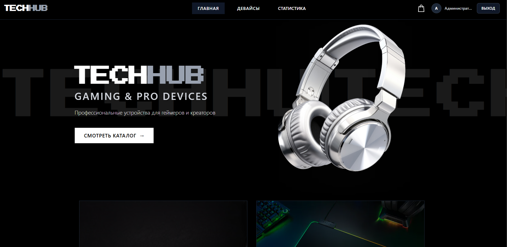
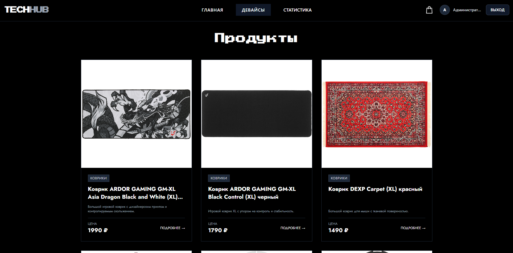
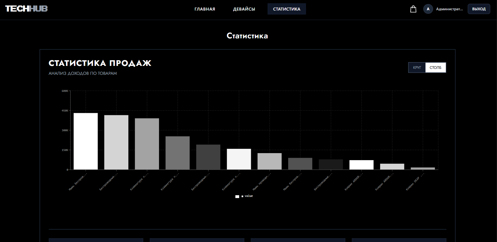

# TECHHUB 💻  
Интернет-магазин компьютерных девайсов

## О проекте

**TECHHUB** — это полнофункциональное веб-приложение интернет-магазина компьютерных аксессуаров (наушники, клавиатуры, мыши, коврики), разработанное в рамках учебной практики на 3 курсе колледжа на заказ.

Проект реализует полный цикл работы интернет-магазина: от просмотра каталога товаров до оформления заказа и анализа продаж. Основной акцент сделан на взаимодействии frontend и backend, а также на удобстве пользовательского интерфейса.

## Демо





---

## Задача проекта

- разработать fullstack-приложение интернет-магазина  
- реализовать взаимодействие frontend ↔ backend  
- создать систему авторизации и регистрации  
- реализовать каталог товаров с категориями  
- разработать корзину и оформление заказов  
- добавить систему аналитики и статистики  
- создать адаптивный интерфейс  

---

## Функционал

- каталог товаров с разделением по категориям  
- просмотр карточек товаров  
- добавление товаров в корзину  
- оформление заказов  
- регистрация и авторизация пользователей  
- личный кабинет пользователя  
- просмотр статистики продаж  
- адаптивная верстка  

---

## Технологии

### Frontend
- React  
- Vite  
- Tailwind CSS  
- Ant Design  

### Backend
- Node.js  
- Express  

### Database
- SQLite3  


---

## Роль в проекте

**Выполненные задачи:**

- разработка frontend части (React)  
- разработка backend API (Node.js + Express)  
- проектирование и реализация базы данных  
- настройка взаимодействия клиента и сервера  
- реализация системы авторизации и регистрации  
- разработка логики корзины и заказов  
- реализация системы статистики продаж  

---

## Что решает проект

**Проект демонстрирует:**

- создание полноценного интернет-магазина  
- реализацию бизнес-логики (заказы, товары, пользователи)  
- взаимодействие клиентской и серверной части  
- работу с базой данных  

---

## Практикуемые навыки

- React (компонентная архитектура)  
- работа с REST API  
- Node.js и Express  
- проектирование БД  
- работа с SQLite3  
- управление состоянием приложения  
- построение fullstack архитектуры  

---

## Структура проекта

```
TECHHUB/
├── backend-database/
│ ├── database.db
│ ├── server.js
│ ├── database.js
│
├── frontend/
│ ├── public/
│ ├── src/
│ │ ├── assets/
│ │ ├── components/
│ │ │ └── ui/
│ │ ├── pages/
│ │ ├── stores/
│ │ ├── App.jsx
│ │ └── routes.js
│ ├── index.html
│ └── package.json
│
├── README.md
```

---

## Запуск проекта

**1. Клонирование репозитория**
```
git clone https://github.com/Kirikiri2/TECHHUB-react.git
cd TECHHUB-react
```
**2. Запуск backend**
```
cd backend/backend-database
npm install
node start
```
**3. Запуск frontend**
```
cd ../../frontend
npm install
npm run dev
```

**Данные админа:**
 - Логин: admin@example.com
 - Пароль: admin123

---

## Итог

Проект успешно реализован в рамках учебной практики и соответствует требованиям заказчика:

 - реализовано взаимодействие frontend и backend
 - создана полноценная система интернет-магазина
 - реализована бизнес-логика заказов и пользователей
 - добавлена аналитика продаж

Работа была сдана в срок, а заказчик остался доволен результатом и оценкой проекта.
